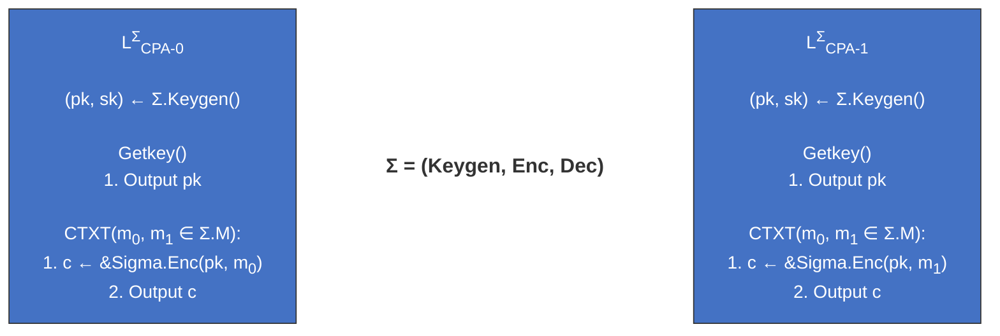
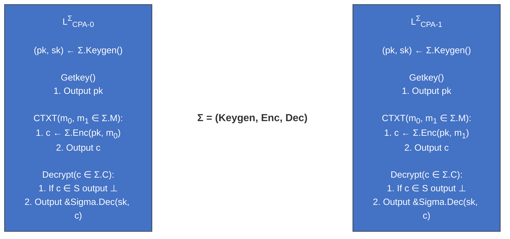
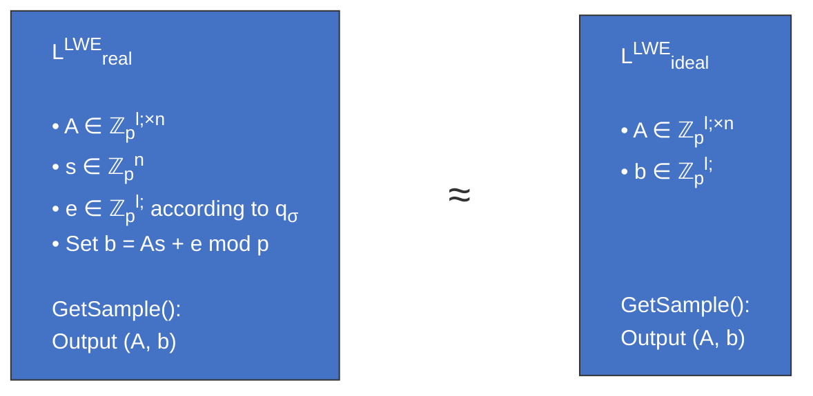
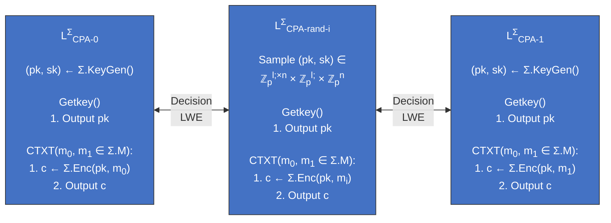

# Public Key Encryption (PKE) / Asymmetric Cryptography

> [!IMPORTANT]
> - Involves two seperate but mathematically related keys per user (**private** and **public**). Given a public key, it is computationally infeasible to derive the corresponding private key.
> - **Confidentiality**: The sender encrypts the message using the receiver's public key. Only the receiver can decrypt the message using their private key.
> 
> A **symmetric key encryption scheme** scheme consists of 3 algorithms:
> - $Keygen()$, outputs a key pair $(pk, sk) \in PK \times SK$
> - $Enc(pk, m \in M)$, outputs a ciphertext $c \in C$
> - $Dec(sk, c \in C)$, outputs a plaintext $m \in M$
>
> where: Message space $M$, Ciphertext space $C$, Public key space $PK$, Secret key space $SK$.

## Correctness
Let $(Keygen, Enc, Dec)$ be a PKE cryptosystem and $K, M, Pk, SK$ be fixed Then it is correct iff:

$$
\forall (pk, sk) \leftarrow Keygen(), \\ \forall m \in M: Pr[Dec(sk, Enc(pk, m)) = m] = 1
$$

## The RSA Cryptosystem
$Keygen()$:
1. find two large primes $p, q$ and $e$ such that $gcd(e, (p-1)(q-1)) = 1$
2. Compute $N = p \cdot q$
3. Compute $d$ such that $d \cdot e \equiv 1 \mod (p-1)(q-1)$
4. output $pk = (N, e), sk = d$

$Enc(pk, m)$:
1. $pk = (N, e), m \in \mathbb{Z}_N^*$
2. Compute $c = m^e \mod N$

$Dec(sk, c)$:
1. $sk = d, c \in \mathbb{Z}_N^*$
2. Compute $m = c^d \mod N$

### Correctness

- $N = p \cdot q = p -1 \cdot (q -1)$
- We choose $gcd(e, p -1 \cdot q -1) =1$ so $d = e^{-1} \mod \varphi(N)$ always exists
- Euler’s Theorem: $\forall x \in \mathbb{Z}_N^* : x^{\varphi(N)} =1 \mod N$
- $Dec(sk,Enc (pk,m))= (m^e)^d \mod N =m^{1+k\varphi(N)} =m \mod N$

### Security
  >  [!NOTE]  
  >RSA assumption: Given a random public key $(N, e)$ and a ciphertext $c \in \mathbb{Z}_N^*$, it is computationally infeasible to compute $m \in \mathbb{Z}_N^*$ such that $c \equiv m^e \mod N$.




#### IND-CPA
> [!TIP]
> - RSA is **NOT** IND-CPA secure
> - The cryptosystem is deterministic: the same message encrypted with the same public key always results in the same ciphertext. An attacker can easily distinguish between two messages by encrypting them and comparing the ciphertexts. 
> - The encryption/decryption is bijective


#### CCA Security
> [!TIP]
> - RSA is **NOT** IND-CCA secure
> - An attacker can exploit the deterministic nature of RSA encryption to decrypt ciphertexts. Given a ciphertext $c$, the attacker can compute $c' = c \cdot Enc(pk, m')$ for some known message $m'$. By querying the decryption oracle with $c'$, the attacker can derive information about the original message $m$.
>  
> $$
    m_1 \larr c_1 \\ 
    m_2 \larr c_2 \\
    m_1 \cdot m_2 \equiv c_1 \cdot c_2 \mod N
> $$ 
>

**Solving IND-CCA problem**

- Use **padding schemes** such as OAEP (Optimal Asymmetric Encryption Padding) to add randomness to the plaintext before encryption, making it probabilistic.

## RSA-OAEP
> [!IMPORTANT]
> RSA-OAEP (Optimal Asymmetric Encryption Padding) is a padding scheme used in conjunction with RSA encryption to enhance its security. It adds randomness and structure to the plaintext before encryption, making it more resistant to various attacks, including chosen ciphertext attacks (CCA).

Let $k = 8 \cdot [\log_8 N]$ and $k_0, k_1 > 128$, $n = k - k_0 - k_1$ <br>
**Messages** $m \in \{0,1\}^n$ <br>
**Hash functions** $G: \{0,1\}^{k_0} \rightarrow \{0,1\}^{n+k_1}$, $H: \{0,1\}^{n+k_1} \rightarrow \{0,1\}^{k_0}$


$$
A = [\overbrace{\underbrace{(m|0^{k_1})}_{\text{Padded message}} \oplus \underbrace{G(R)}_{\text{Add One-time pad}}}^{B_0},
\overbrace{\underbrace{R \oplus}_{\text{OTP key}}\underbrace{H \big(\underbrace{(m|0^{k_1}) \oplus G(R)}_{B_0}\big)}_{H(B_0)}}^{B_1}]
$$

**Encryption for $m, N, e$:**
1. Sample random bit string $R \in \{0,1\}^{k_0}$
2. Compute $A = [(m|0^{k_1}) \oplus G(R), R \oplus H\big((m|0^{k_1}) \oplus G(R)\big)]$
3. Set $c = A^e \mod N$
   
**Decryption for $c, N, d$:**
1. Compute $A' = c^d \mod N$ and check if $A' < 2^k$
2. Let $A' = [B_0, B_1]$ and compute $R' = H(B_0) \oplus B_1$
3. Compute $m' = B_0 \oplus G(R')$. If $m'$ ends with $k_1$ 0-s then recover $m$

### Security
$x \in \mathbb{Z}_N^*$ is a bitstring of length $k \approx [\log_2 N]$

$m \in \{0,1\}^n$ are encrypted messages, where $n \ll k$.

$$
(\underbrace{Enc_R(m|0 \dots 0)}_{B_0} | Enc_{B_0}(R))^e \mod N
$$

1. Unstructured encryption prevents *targeted manipulation*
2. $0 \dots 0$ *prevents decryption* of manipulated ciphertexts

## Learning With Errors (LWE) Problem
> [!IMPORTANT]
> - The Learning With Errors (LWE) problem is a foundational problem in lattice-based cryptography. It involves solving systems of linear equations that are perturbed by small random errors.
> - The LWE problem is considered hard to solve, even for quantum computers, making it a promising candidate for post-quantum cryptography.
> 
> $$
>   A \in \mathbb{Z}_q^{l \times n}, s \in \mathbb{Z}_q^n, b \in \mathbb{Z}_q^l , e \in \mathbb{Z}_q^l \larr q_{\sigma}\\
    As = b + e \mod p \implies As \approx b \mod p
> $$



## Regev's public-key encryption scheme (LWE-based PKE)
$KeyGen()$:
1. Sample:
    - $A \larr \mathbb{Z}_p^{l \times n}$
    - $s \larr \mathbb{Z}_p^n$
    - $e \larr \mathbb{Z}_p^l$ according to $q_{\sigma}$
2. Compute $b = As + e \mod p$
3. Output $pk = (A, b), sk = s$

$Enc(pk, m \in \{0,1\})$:
1. Sample $r \larr \{0,1\}^l$
2. Compute:
    - $c_0 = r^T A \mod p$
    - $c_1 = r^T b + \frac{p-1}{2} m \mod p$
3. Output $c = (c_0, c_1)$

$Dec(sk, c = (c_0, c_1))$:
1. Compute $m' = \lfloor 2p^{-1} (c_1 - c_0 s) \rfloor \rceil \mod p$ where division by $p$ and rounding are over $\R$
2. Output $m'$

### Correctness
**Decryption:**
```math
    \begin{align*}
        (c_1 - \mathbf{c}_0\mathbf{s}) &= \mathbf{r}^T\mathbf{b} + m \cdot \frac{p-1}{2} - \mathbf{r}^T\mathbf{As} \\
        &= \mathbf{r}^T(\mathbf{As} + \mathbf{e}) + m \cdot \frac{p-1}{2} - \mathbf{r}^T\mathbf{As} \\
        &= \mathbf{r}^T\mathbf{e} + m \cdot \frac{p-1}{2}
    \end{align*}
```

Rounding: $2p^{-1}(c_1 - \mathbf{c}_0\mathbf{s}) = \underbrace{2p^{-1}\mathbf{r}^T\mathbf{e}}_{\substack{\text{Small } \rightarrow \\ \text{rounds to } 0}} + \underbrace{m \cdot \frac{p-1}{p}}_{\text{Rounds to } m}$

### Security

#### IND-CPA (based on decision-LWE)
> [!TIP]
>Regev's PKE scheme is IND-CPA secure under the assumption that the decision-LWE problem is hard. The security proof involves constructing a series of hybrid games that transition from the real encryption scheme to an idealized version where ciphertexts are independent of the plaintexts.

Encryption of a one-bit message 𝑚∈{0,1}: 
Sample 𝒓∈ 0,1 ℓ
Compute 𝒄0 =𝒓𝑇𝑨, 𝑐1 =𝒓𝑇𝒃+𝑚⋅(𝑝−1)/2 and 
output  𝑐 =(𝒄0,𝑐1)

Encryption of a one-bit message $m \in \{0, 1\}$:
- Sample $\mathbf{r} \in \{0, 1\}^\ell$
- Compute $\mathbf{c}_0 = \mathbf{r}^T A$
- Compute $\mathbf{c}_1 = \mathbf{r}^T \mathbf{b} + m \cdot \frac{p-1}{2}$ 
- Output $c = (\mathbf{c}_0, c_1)$



### Efficiency improvements

#### 1. Encrypt vector
- Instead of encrypting one bit at a time, encrypt vectors of bits to improve efficiency.
- Modify the encryption algorithm to handle vector inputs and perform matrix operations accordingly.

$KeyGen()$:
1. Sample:
    - $A \larr \mathbb{Z}_p^{l \times n}$
    - $\bold{\textcolor{red}{S \larr \mathbb{Z}_p^{n \times v}}}$
    - $\bold{\textcolor{red}{E \larr \mathbb{Z}_p^{l \times v}}}$ according to $q_{\sigma}$
2. Compute $B = AS + E \mod p$
3. Output $pk = (A, B), sk = S$

$Enc(pk, \bold{\textcolor{red}{m \in \{0,1\}^v}})$:

$Dec(sk, c = (c_0, c_1))$:

#### 2. Larger plaintext space
- Instead of encrypting single bits, encrypt larger plaintexts by adjusting the scaling factor in the encryption algorithm.
- This allows for more efficient use of the ciphertext space and reduces the number of encryption operations needed for larger messages.

$KeyGen()$:

$Enc(pk, \bold{\textcolor{red}{m \in \{0, \dots, t-1\}^v}})$:

$Dec(sk, c = (c_0, c_1))$:

#### 3. Algebra
- Regev $\rightarrow$ Dual Regev
- Matrix $A$ is larger. Matrix multiplications is inefficient.
- Replace $A, s, e$ with polynomials and use polynomial multiplication (more efficient), smaller $pk / c$ .   