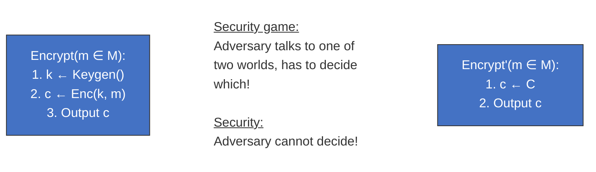
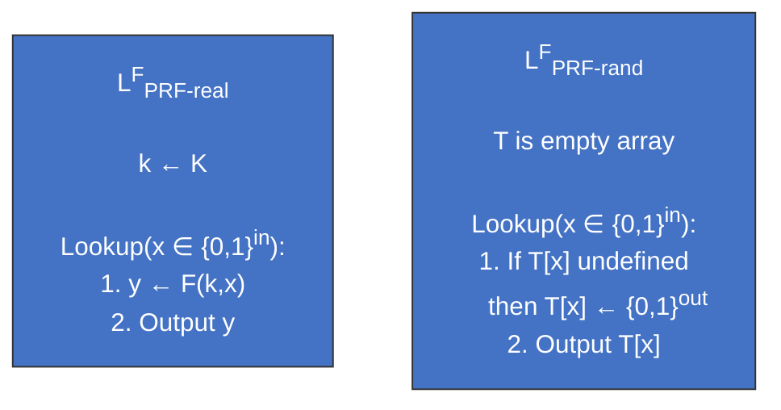
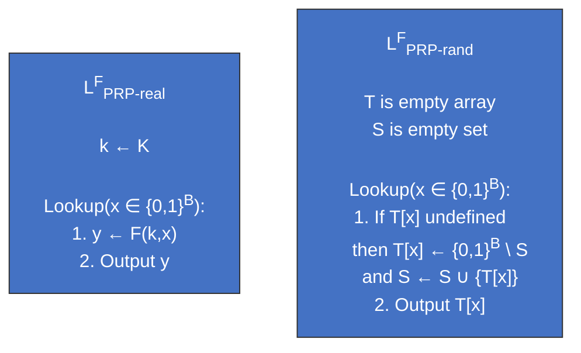
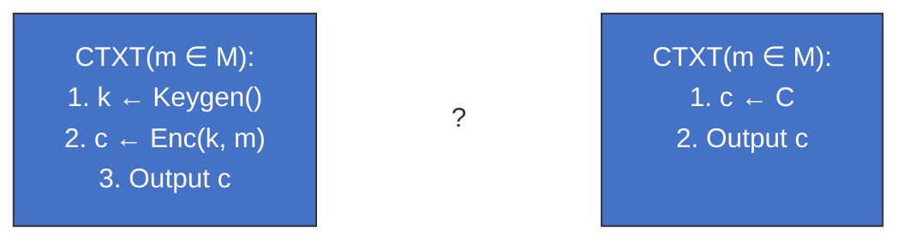
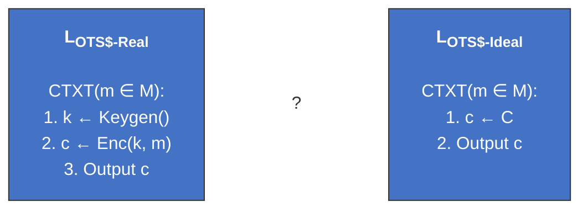
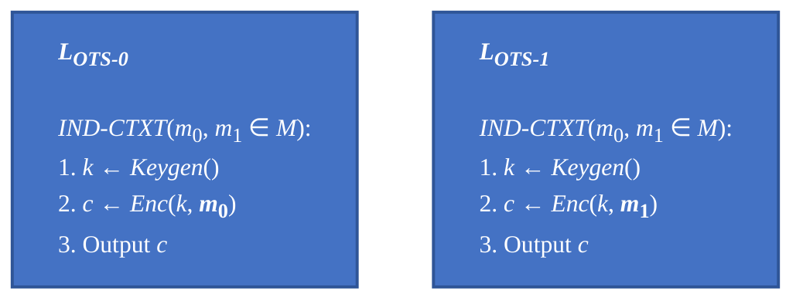

## Security game

Formally the security definition is as follows:  
Let a **library** be a set of procedures with shared state.  
Let $A \circ L$ be an algorithm which, with black-box access to a library L, outputs a bit $b$.  

We write $L_1 \equiv L_2$ if for all algorithms $A$,  
$$Pr[A \circ L_1 = 1] = Pr[A \circ L_2 = 1]$$

We write $L_1 \approx L_2$ if for all polynomial-time (in $\lambda$) algorithms $A$
$$|Pr[A \circ L_1 = 1] - Pr[A \circ L_2 = 1]|$$
is negligible in $\lambda$.

**Properties:**

Let $L_1, L_2, L_3, L$ be libraries.
1. If $L_1 \equiv L_2$ then $L_1 \approx L_2$
2. If $L_1 \approx L_2$ and $L_2 \approx L_3$ then $L_1 \approx L_3$
3. If $L_1 \approx L_2$ and $L$ runs in polynomial time, then $L \circ L_1 \approx L \circ L_2$

## Pseudorandomness

### Pseudorandom Functions

A deterministic function $F: \{0,1\}^{\lambda} \times \{0,1\}^{in} \rightarrow \{0,1\}^{out}$ is a Pseudorandom function if $L_{PRF-real}^F \approx L_{PRF-rand}^F$ where:

**Cons**
- Not injective
- Not efficiently invertible

### Pseudorandom Permutations
A deterministic function $F: \{0,1\}^{\lambda} \times \{0,1\}^{B} \rightarrow \{0,1\}^{B}$ is a Pseudorandom permutation if

1. There is an efficient function $F^{-1}: \{0,1\}^{\lambda} \times \{0,1\}^{B} \rightarrow \{0,1\}^{B}$ such that $\forall k \in \{0,1\}^{\lambda}, \forall x \in \{0,1\}^{B}: F^{-1}(k, (F(k,x))) = x$

2. $L_{PRP-real}^F \approx L_{PRP-rand}^F$ where

### PRP-PRF Switching Lemma

> Lemma (PRP-PRF switching):  
Let $𝑃$ be a $PRP$ and $𝐹$ be a $PRF$ with security parameter $\lambda$, both with $l_{in} = l_{out} = \lambda$. Then the libraries $L^{F}_{PRF-real}$ and $L^{F}_{PRP-real}$ are computationally
indistinguishable

### Constructing PRPs from PRFs
Turn *PRF* $F:\{0, 1\}^\lambda \times \{0, 1\}^{in} \rarr \{0, 1\}^{out}$ into *PRP* $F':\{0, 1\}^\lambda \times \{0, 1\}^{B} \rarr \{0, 1\}^{B}$ 

Idea: 
$\boxed{F'(k, m) = F(k, m) \oplus m}$ 

## Birthday Paradox

𝐵𝑖𝑟𝑡ℎ𝑑𝑎𝑦𝑃𝑟𝑜𝑏 $(𝑞, 𝑁)$ is the probability that, when sampling $𝑞$
elements from a set of size $𝑁$ (with replacement) we find a collision

$$
    𝐵𝑖𝑟𝑡ℎ𝑑𝑎𝑦𝑃𝑟𝑜𝑏 (𝑞, 𝑁) = 1 - \prod^{q - 1}_{i = 1}{(1 - \frac{i}{N})}
$$

### IND-CPA & IND-CCA Security

> [!TIP]
> $\text{IND-CPA}$ **(Indistinguishability under Chosen-Plaintext Attack)** is an attack in which the adversary prompts the encryption oracle with a pair of specially chosen plaintexts, which improves the adversary's chances of distinguishing between the real and ideal worlds. 

> [!TIP]
> $\text{IND-CCA}$ **(Indistinguishability under Chosen-Ciphertext Attack)** is a stronger attack where the adversary prompts the decryption oracle with specifically modified ciphertexts of their choice (except for the challenge ciphertext). This further enhances the adversary's ability to distinguish between the real and ideal worlds.

## Defining running time

A program runs in polynomial time if there exists a constant $c > 0$ such
that for all sufficiently long input strings 𝑥, the program stops after no
more than $O(|x|^c)$ steps.
We will require that an attacker runs in polynomial time in $\lambda$

## Negligible functions

A function $f: \mathbb{N} \rightarrow \mathbb{R}$ is negligible if for every polynomial $p$:

$$
    \lim_{\lambda \to \infty} p(\lambda) \cdot f(\lambda) = 0
$$

In different terms, $f(\lambda)$ is negligible if it is eventually smaller than
any polynomial $1/|p(\lambda)|$

A polynomial-time attacker runs in time $q(\lambda)$. It can make at most $q(\lambda)$
queries or computations.  
Keyspace of size $2^\lambda$.  
Attacker finds correct key with probability $q(\lambda)/2^\lambda$.

>If $q(\lambda) \leq \lambda^C$, then $2^{\log_{2}{q(\lambda)} - \lambda} \leq 2^{C \dot \log_{2}{\lambda}- \lambda}$ is negligible.

# Symmetric Key Encryption Scheme

> [!IMPORTANT]
> A **symmetric key encryption scheme** scheme consists of 3 algorithms:
>- $Keygen$ is a randomized algorithm that outputs a key $k \in K$
>- $Enc$ is a _possibly randomized_ algorithm that takes a key $k \in K$ and plaintext $m \in M$ and outputs a ciphertext $c \in C$   
>- $Dec$ is a deterministic algorithm that takes a key $k \in K$ and ciphertext $c \in C$ and outputs a plaintext $m \in M$
>
>$K$ is called the key space  
>$M$ is the message space  
>$C$ is the ciphertext space

## Correctness: 

Let $Keygen$, $Enc$, $Dec$ be a symmetric-key cryptosystem and $K$, $M$, $C$ be fixed.  
Then it is correct iff 
$$\forall k \in K, \forall m \in M: Pr[Dec(k, Enc(k, m)) = m] = 1$$

## Security:
> [!NOTE]
> - A symmetric-key encryption scheme is secure if each ciphertext is equally likely to correspond to any plaintext.
> - It i secure if an adversary cannot distinguish between the following two worlds:

## Disadvantages of Symmetric Cryptography
- The chicken-and-egg problem
  - You need a shared key $k$k to establish a secure channel
  - You need a secure channel to share the key $k$
- Scalability problems:
  -  A network of $n$ users needs $n(n-1)/2$ exchanged keys $\implies O(n^2)$ for $n$ nodes
  - Or you use a single network-wide key. If one node gets compromised, whole network get compromised

## Kerchhoff's Principle

> - The security of a cryptographic system should depend only on the secrecy of the key
> - Security relies on the method by which the key is chosen (an algorithm the adversary knows)

## Caesar’s cipher

$$
    A \rarr 0 \\ 
    B \rarr 1 \\ 
    C \rarr 2
$$

Key space $K \in \{0, \dots, 25\}$  
Plaintext space $M \in \{0, \dots, 25\}^*$  
Ciphertext space $C \in \{0, \dots, 25\}^*$

$\text{Keygen()}$:
1. Sample $k \larr \{0, \dots, 25\}$
2. Output $k$ 

$\text{Encrypt}(m)$:
1.  Let $c$ be an array of length $|m|$
2.  For $i = 1, \dots, \ell: c[i] := m[i] + 3 \pmod{26}$
3.  Output $c$

$\text{Decrypt}(c)$:
1.  Let $m$ be an array of length $|c|$
2.  For $i = 1, \dots, \ell: m[i] := c[i] - 3 \pmod{26}$
3.  Output $m$

Correct: For each $i \in |m|$ it holds that
$$
\begin{aligned}
&\text{Decrypt}(\text{Encrypt}(m[i])) \\
&= m[i] + 3 - 3 \pmod{26} \\
&= m[i] \pmod{26}
\end{aligned}
$$

### Kerchhoff's Principle in Caesar's Cipher
 - The security of Caesar's cipher relies solely on the secrecy of the key $k$
 - If an adversary knows the algorithm (which they do), they can easily decrypt messages if they know $k$ or can try all possible keys (only 26 in this case)
 - Therefore, the strength of the cipher is determined by how well the key is kept secret

### $\lambda - Ceaser$ 

Encrypt $m$ with the sum of $\lambda$ different keys $c = m + \sum_{i=1}^\lambda k_i$,
which may lead to a case of $m + Sum_k \equiv m \pmod {26}$

## Vigenere Cipher
 - A method of encrypting alphabetic text by using a simple form of polyalphabetic substitution
 - Uses a keyword to determine the shift for each letter in the plaintext

$m, c \in \{0, \dots, 25\}^{\lambda \cdot r} \\ k \in \{0, \dots, 25\}^\lambda$

**Keygen():**
1.  Sample $k \larr \{0, \dots, 25\}^\lambda$
2.  Output $k$

**Encrypt($k, m$):**
1.  Let $c$ be an array of length $\lambda \cdot r$
2.  For $i = 0, \dots, \lambda \cdot r - 1$:
    -  Let $c[i] = m[i] + k[i \pmod \lambda]$
3.  Output $c$

**Decrypt($k, c$):**
1.  Let $m$ be an array of length $\lambda \cdot r$
2.  For $i = 0, \dots, \lambda \cdot r - 1$:
    1. Let $m[i] = c[i] - k[i \pmod \lambda]$
3.  Output $m$

## One-Time Pad (*OTP*)

𝑀 = 𝐶 = 𝐾 = 0,1 !
Keygen():
1. Sample 𝒌 ← 𝐾
2. Output 𝒌
Enc(𝒌, 𝒎):
1. Output the coordinate-wise operation 𝒌 ⊕ 𝒎
Dec 𝒌, 𝒄 :
1. Output the coordinate-wise operation 𝒌 ⊕ 𝒄
Correctness: 𝐷𝑒𝑐 𝒌, 𝐸𝑛𝑐 𝒌, 𝒎 = 𝒌 ⊕ 𝒌 ⊕ 𝒎 = 𝒌 ⊕ 𝒌 ⊕ 𝒎 = 𝟎 ⊕ 𝒎 = 𝒎

$M = C = K = \{0,1\}^\lambda$

$Keygen()$:
1. Sample $k \larr \{0,1\}^\lambda$
2. Output $k$

$Enc(k, m)$:
1. Output the coordinate-wise operation $k \oplus m$

$Dec(k, c)$:
1. Output the coordinate-wise operation $k \oplus c$
   
### Correctness: 

$$Dec(k, Enc(k, m)) = k \oplus k \oplus m = 0 \oplus m = m$$

### Security:
> [!NOTE]
> - The One-Time Pad is unconditionally secure when the key is truly random, at least as long as the message, and used only once
> - Each possible plaintext is equally likely for any given ciphertext, making it impossible for an adversary to gain information about the plaintext without knowing the key
>
>$$
>    L_{OTS\$-Real} \equiv L_{OTS\$-Rand}
>$$

 
#### Proof
Trivial: For every 𝑚 ∈ 𝑀, 𝑐 ∈ 𝐶 $L_{OTS\$-Rand}$ outputs 𝑐
with probability 1/|𝐶|.
Want to show:
For every 𝑚 ∈ 𝑀, 𝑐 ∈ 𝐶:
Pr 𝑐 = 𝐸𝑛𝑐(𝑘, 𝑚) 𝑘 ← 𝐾𝑒𝑦𝑔𝑒𝑛() = 1/|𝐶|
Proof:
1. If 𝑐 = 𝐸𝑛𝑐 𝑘, 𝑚 = 𝑘 ⊕ 𝑚 then 𝑘 = 𝑐 ⊕ 𝑚
2. Since 𝐾𝑒𝑦𝑔𝑒𝑛() chooses* uniformly at random from 𝐾,
its output agrees with 𝑘 with probability 1/|𝐾|.
𝐾 = 𝐶, so the result follows.

No matter the choice of 𝑚, every ciphertext 𝑐 will be
equally likely no matter if it's $L_{OTS\$-Real}$ or $L_{OTS\$-Rand}$.
But 𝑐 is the only thing any algorithm 𝐴 sees when running
with either library.

$$
   \implies L_{OTS\$-Real} \equiv L_{OTS\$-Rand}
$$

#### Security measure: key length
 - The key must be at least as long as the message to ensure security
 - If the key is shorter, patterns in the plaintext can be exploited by an adversary, compromising the security of the encryption

> [!TIP]
>For $|K| = 2^\lambda$ of length $\lambda$ bits, once we have large enough $\lambda$, $f(\lambda) = 2^\lambda$ grows exponentially. We can say that the OTP is "computationally secure" against adversaries limited to running in time polynomial in $\lambda \rarr p(\lambda) = \lambda^C$. 

An algorithm with linear runtime (in 𝜆) may e.g. make a single guess of 𝑘.  
Probability of correct guess is $\frac{1}{|K|} = \frac{1}{2^\lambda}$

#### IND-CPA
> [!TIP]
> An SKE $𝐾𝑒𝑦𝑔𝑒𝑛, Enc, Dec$ is one-time indistinguishable under chosen plaintext (or left-or-right indistinguishable) if: 
> 
> $$
>   L_{OTS\$-0} \equiv L_{OTS\$-1}
> $$

